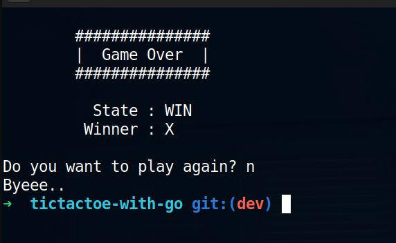

# TicTacToe (with golang)

## Description
- simple terminal base tictactoe game with golang
- two players can play the game (X and O)

## Screenshots

## Dependencies
- golang 
- git (for clone the repo)

## Purpose
- learn more about golang basic syntax
- learn how to write testcases and run them

## Setup
- clone the repo `git clone https://github.com/hashen47/tictactoe-in-go.git`
- then to go the repo folder and run `go run .`
